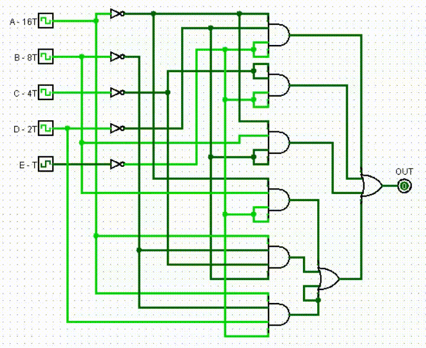

# SOS Business Card PCB

This project was conceived for the [Hackaday 2024 Business Card Contest](https://hackaday.io/contest/195949-2024-business-card-contest). The idea was to create a logical circuit from discrete components that would generate a SOS signal in Morse code. I wanted to make this project a learning experience for creating logical circuits in a simple and practical way.

## Logical Circuit Design

Morse code has following rules for signaling:

- dot is 1 time unit
- dash is 3 time units
- the space between symbols of the same letter is 1 time unit
- the space between words is 7 time units.

Following these rules SOS signal timing diagram will look like this:

> Diagram is made with [wavedrom online tool](https://wavedrom.com/editor.html). You can import json file from `Design/Wavedrom` for modifications.

We see that 34 independent logical states are needed. This introduces a problem as we could reduce logical circuit complexity by using 32 states instead as it will require 5 inputs for our truth table $(2^5=32)$.

I decided to violate last Morse code signaling rule and use 5 time units for spacing between words instead of 7.

I'm using [Logism](http://www.cburch.com/logisim/), it can take truth table as input and generate logical circuit. You can find Logism circuit files in `Design/Logism` directory. Generated circuit is not perfect and can be improved manually (by removing duplicated components and changing number of inputs for logical gates).

    

## Clock Circuit Design

For clock signal I'm using 555 timer. There are lots of tools online for calculating 555 timer circuit parameters. I used [555 Astable Circuit Calculator ](https://ohmslawcalculator.com/555-astable-calculator) for this.

General rules are:

- choose R2 value much higher than R1 for 50% duty cycle;
- C9 sets clock frequency. 330nF capacitor will generate 2Hz signal. To increase frequency, decrease C9 value.

    

For generating 5-bit logic circuit input signal we'll need binary counter. It will divide clock signal frequency by 2/4/8/16 and so on.

Full circuit simulation with 555 clock generator, binary counter and logical circuit was done using [Falstad](https://tinyurl.com/2bdrotlr). If link doesn't work, you can find Falstad circuit file in `Design/Falstad` directory.

## Power

Circuit will have 2 power options:

- CR2025 coin battery
- USB-C 5V@3A

USB-C socket CC lines are connected to ground via 5.1K ohm resistor. This tells power source to supply 5V on VBUS line. Most ICs I chose have maximum supply voltage of 6V.

## Output

The circuit will have a small on-board LED for SOS signal output. Additionally, a high-side PMOS load switch can be connected to a larger load, such as a 12V lamp. An external power supply with a maximum of 40V will be needed for this.

    

## PCB Design

PCB is designed using KiCAD. All project and gerber files are in `KiCAD` directory.
Full [schematic](schematic.pdf) exported as pdf.

There are some custom symbols and footprints used in this project. Those can be imported from [this](https://github.com/f5AFfMhv/my-kicad-libraries) github repository.

## Finished Project

    

Youtube video.

